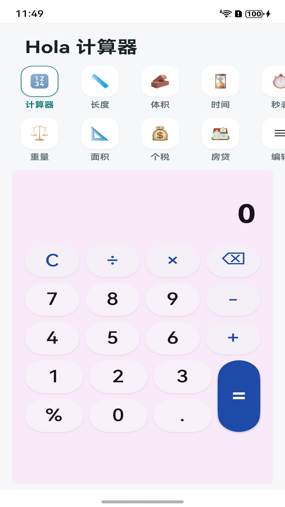
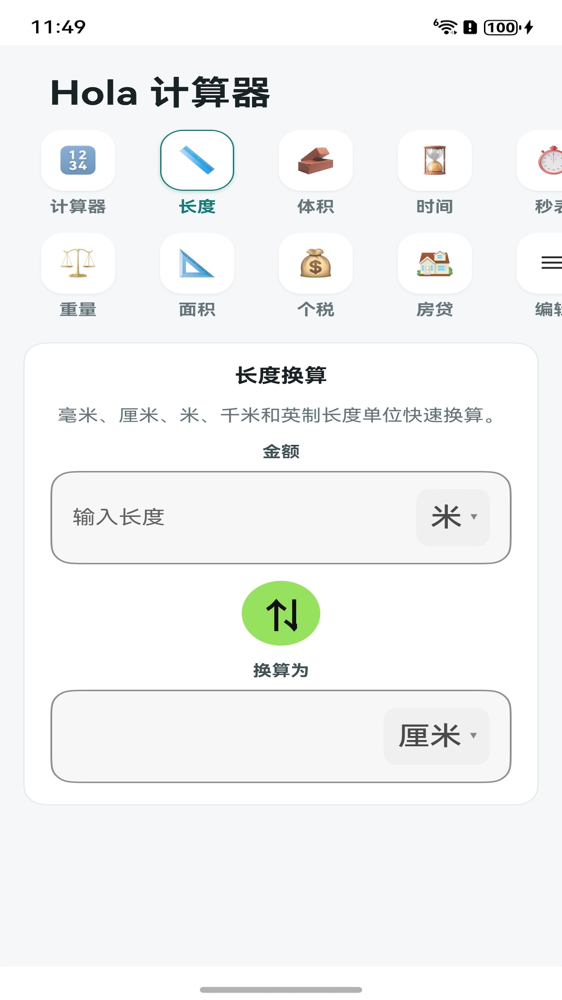
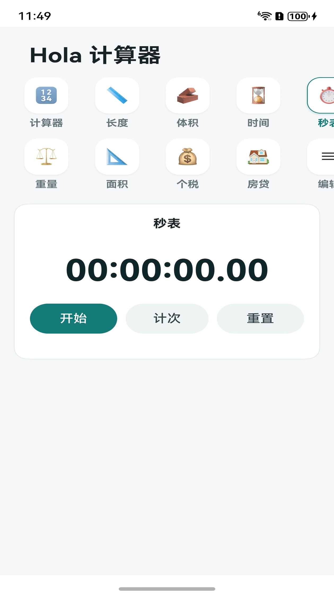
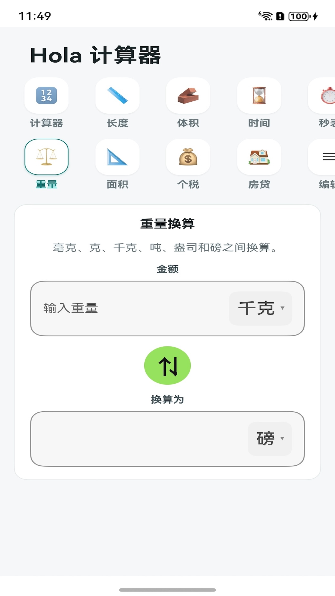

# 通过 Vibe Coding，我开发的第一款 App 上架鸿蒙了，欢迎大家下载体验

## 前言

作为一个非科班出身的开发者，我一直有一个想法：**能不能自己做一款 App 上架应用商店？**

这个念头在脑子里转了很久，但每次想到要从零搭建一个完整的 App——UI 设计、业务逻辑、打包签名、上架审核——就觉得工程量太大，迟迟没有动手。

直到最近接触了 **Vibe Coding** 这个概念，一切变得不一样了。

## 什么是 Vibe Coding？

Vibe Coding 的核心理念很简单：**你只需要描述你想要什么，让 AI 帮你写代码。**

你不需要精通每一门语言的语法，不需要记住每个 API 的参数，甚至不需要从头搭建项目骨架。你要做的，是把脑子里的想法清晰地表达出来，然后和 AI 一起迭代，直到它变成现实。

这种开发方式特别适合像我这样的「想法驱动型」开发者——**有产品直觉，但不想在工程细节上消耗太多精力。**

## 我做了什么：Hola 计算器

我用 Vibe Coding 开发了一款名为 **Hola 计算器** 的鸿蒙应用。

说是「计算器」，但它远不止加减乘除。它更像是一个**日常生活工具箱**，把日常高频使用的计算功能整合到了一个应用里：

| 功能 | 说明 |
|:---:|:---|
| 基础计算器 | 加减乘除、百分比、小数运算，支持运算符优先级 |
| 长度换算 | 毫米、厘米、米、千米、英寸、英尺、码、英里 |
| 体积换算 | 毫升、升、立方厘米、立方米、加仑 |
| 时间换算 | 秒、分钟、小时、天、周、月、年 |
| 重量换算 | 毫克、克、千克、吨、盎司、磅 |
| 面积换算 | 平方米、亩、公顷、平方千米、平方英尺 |
| 秒表 | 毫秒级精度，支持多次计次记录 |
| 个税估算 | 综合所得年度口径，支持专项附加扣除、月度明细 |
| 房贷计算 | 商业贷款 / 公积金 / 组合贷，等额本息 / 等额本金 |

## 效果展示

| 计算器 | 长度换算 | 个税估算 | 秒表 | 重量换算 |
|:---:|:---:|:---:|:---:|:---:|
|  |  |  |  |  |

## 开发过程回顾

### 第一步：描述需求

我没有写一行代码，而是先用自然语言把想要的功能描述出来：

> "我想做一个鸿蒙上的万能计算器 App，包含基础计算器、单位换算（长度、体积、时间、重量、面积）、秒表、个税估算和房贷计算。UI 要简洁清爽，用分类标签切换不同功能。"

AI 根据这段描述生成了项目骨架和初始代码。

### 第二步：迭代打磨

第一版代码肯定不会完美。接下来我做的事情就是**不断试错、不断调整**：

- 个税计算的专项附加扣除项一开始少了几项，补充后对齐了最新政策
- 房贷计算从只支持商业贷款，逐步迭代到支持公积金和组合贷
- UI 从最初的朴素样式，打磨成了现在清爽的卡片式布局
- 分类标签增加了自定义排序功能，让用户按使用频率调整顺序

整个过程中，**我的角色更像是一个产品经理**——提需求、看效果、反馈问题、确认修改。代码的具体实现全部由 AI 完成。

### 第三步：打包上架

这一步是整个流程中最「工程化」的部分。需要：

1. 在 AppGallery Connect 注册开发者账号
2. 配置签名证书和 Profile
3. 构建 Release 包
4. 提交审核

AI 在这一步也帮了大忙——从配置 `build-profile.json5` 到处理签名证书，基本都是对话式完成的。

## 为什么选择鸿蒙？

- **市场蓝海**：鸿蒙生态还在快速成长期，优质工具类应用有更大的曝光机会
- **开发体验好**：ArkTS + ArkUI 的声明式 UI 写起来很直观，和 Vibe Coding 的思路天然契合
- **一次开发多端部署**：手机和平板都能适配，不用维护多套代码

## Vibe Coding 的感受

用了几周下来，我最大的感受是：**门槛真的在消失。**

以前做一个 App，你需要同时掌握编程语言、框架、构建工具、发布流程……每一道坎都可能劝退一个人。但现在，只要你能清晰地表达想法，AI 可以帮你跨过 80% 的技术障碍。

剩下的 20%——比如理解项目结构、调试边界情况、把控产品质量——反而是更有价值的部分。**你开始像一个真正的创造者，而不是一个码农。**

## 下载体验

Hola 计算器已在华为应用市场上架，欢迎下载体验：

> 搜索「**Hola 计算器**」即可下载

如果你在使用过程中有任何建议或反馈，欢迎在 GitHub 上提 Issue：
https://github.com/andoter0501/HolaCalculator

## 写在最后

这是我用 Vibe Coding 完成的第一个作品。从想法到上架，整个过程比我预想的要快得多。

如果你也有一个产品想法，但一直苦于没有技术背景无法实现——**现在可能是最好的时机。** 打开 AI 编程工具，把你的想法说出来，剩下的事情，交给 Vibe Coding。

> 技术的门槛在降低，但创意的价值从未改变。
